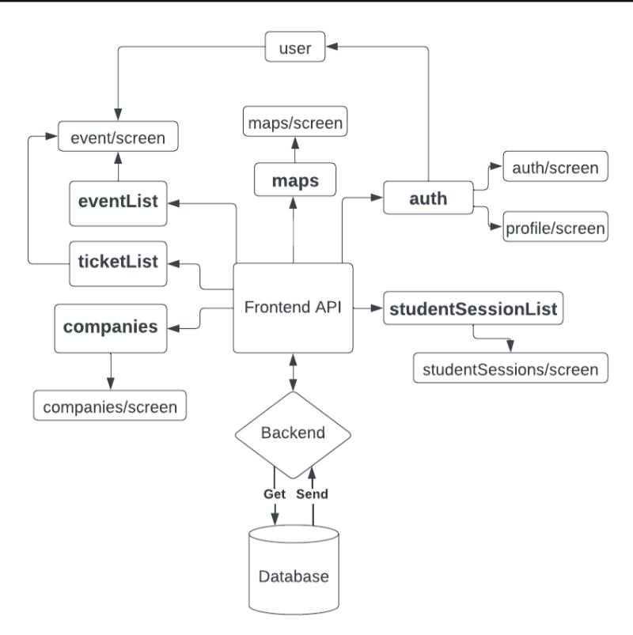

# Nexpo-app

## What is this project?

nexpo-app is the frontend and the graphical interface for the application at ARKAD. This app provides the user (students) with useable features for antending the career fair ARKAD with functionalites such as:

* List of attending companies
* Map of the fair
* Bookable events during the fair
* Student sessions
* Customizable profile

The app is built using the React Native framework and is using the Expo which is a framework for React Native to build mobile applications for Android and iOS.

## Overall Architecture

Esentially this repository have many parts which is affected by the API where all the information is coming from. Our API is sending requests to the backend to fetch information from the database. The API got several parts containing e.g. company lists, authentication for users, user information, tickets for registered users etc. Every part of the API got their dedicated screens in the application which is where the information from the backend is shown on the screen using the graphical interface.


## Required dependencies

- [Node.js](https://nodejs.org/en/download/) (currently running on v.16.14.0)
- Expo CLI
- yarn
- (optional) Expo Go mobile app (on [Android](https://play.google.com/store/apps/details?id=host.exp.exponent&hl=en&gl=US) or [IOS](https://apps.apple.com/us/app/expo-go/id982107779))

## How to setup a build environment

Recommended IDE: Visual Studio Code

If you don't have `yarn` installed you can simply install it with `npm install -g yarn`. `npm` is already on your computer if you have `Node.js`.
Here's how to setup the environment:

1. Clone the nexpo-app repository.
2. Open the terminal in the nexpo-app directory.
3. Run the command `yarn install`
4. Install Expo CLI by running `yarn global add expo-cli`
5. Select the backend to use by setting the environment variable `BACKEND_URL` to the api endpoint to use. If none is set, the public development server will be used. In powershell, this is done by running `$env:BACKEND_URL='http://localhost/api'`, in BASH (Mac and Linux) this is done by running `BACKEND_URL='http://localhost/api'`. If you use the normal command prompt on Windows, switch to powershell or if you really want to use it, run: `set BACKEND_URL=http://localhost/api`

## Starting the project

With every dependency correctly installed to start the app run `yarn run start`. You will notice when the app have been correctly initialized. However, in order to access and view everything in the app you need to have the nexpo-app backend up and running correctly. For information regarding the backend please visit [nexpo-backend-nova](https://github.com/careerfairsystems/nexpo-backend-nova).

You can test your app immediately in the browser. There is also support for testing the app on your mobile phone, please see the next section.

## Expo Go

Expo Go is a mobile app that allows you to preview and test the mobile apps developed with Expo. Expo is a development tool that makes it easier to build React Native apps by providing a set of pre-configured templates and a suite of developer tools. Expo Go is available for both iOS and Android devices and can be downloaded from the App Store or Google Play.

Once you have developed a mobile app using Expo, you can use Expo Go to test and preview the app on your mobile device without having to go through the process of building and publishing the app to the app store. With Expo Go, you can easily see how your app will look and function on a real device, test different features, and make adjustments to your code in real-time.

Expo Go also allows you to share your app with others by generating a QR code that others can scan to access your app. In order for this application to be available in Expo Go you need a Expo version installed on the project for version 46, 47 or 48. Also, your phone and computer need to be connected to the same network in order for this to work. There is a known issue that it's difficult to test Expo Go on school networks (or public ones).

In order to use Expo Go you need to do the following:
To make the backend (nexpo-backend-nova) to actually work on Expo Go you need to change the routing of information as your phone doesn't understand what localhost is. Change the following:
- Be on the same Wi-Fi/Network on phone and computer (Eduroam network doesn't work).
- Fetch the IP address of the network (the IPv4 192.X.X.X usually works)
- Go into nexpo-app and the file called `app.config.ts` and change `backendUrl` to `http://YOUR-IP-ADDRESS:5000/api`
- Go into the nexpo-backend-nova directory
- Change in `launchSettings.json` the `applicationUrl` to `http://YOUR-IP-ADDRESS:5000`
- Change in `appsettings.Development.json` the `Issuer, Audience & BaseUrl` variables where you switch out `localhost` to `YOUR-IP-ADDRESS`. Note that `BaseUrl` need the `:5000` port in order to work

Also, when testing the applciation with Expo Go you need to go into [AppLoader.tsx](screens/AppLoader.tsx) and comment out the following lines:
```
  if (__DEV__) {
    return <View style={styles.container}>{children}</View>;
  }
```
This is because for some reason when accessing the application in Expo Go when in development causes Expo Go to be stuck in the splash screen. These lines of code is mostly used during development as when you save and reload the frontend it will always start the splash screen which causes waiting time to check your progress of your code.

## If something goes wrong

As this project have alot of dependencies (which have their dependencies) it is quite easy to make a mistake when installing packages or auto-updating the dependencies or packages. Please do not auto-update anything and do it manually. The project is very sensitive. One package worth keeping an eye on is the `webpack-dev-server` as this is a development server that allows you to test and develop your web applications. If this package doesn't work everything will crash.

Otherwise it is usually quite easy to spot errors or issues on the frontend as they appear in the console (if testing in the browser) or in the CLI.

##### Github Actions

Currently there are some tests online on Github Actions which tests if packages and dependencies are installed correctly and if there exist some typechecks. This is also controlled through the `test_actions.sh` script explained further down.

## Useable scripts

Note: There exist BAT scripts for this also for Windows users. They do the same thing as the scripts below.

#### runFrontend.sh

This script can be used as a helping hand for running the project. With this script you can reinstall `node_modules` if your packages are out of sync, install `sharp-cli` which is a image processing module and add SSL if this is a issue you're facing. There is a help command available if that is needed (`./runFrontend.sh --help`). If no flag is used when running the script you will simply check if yarn is installed and run the app.

#### test_actions.sh

This script helps the developer with testing the dependencies and packages but also tpyechecks before pushing up new code. This script have four tests available which are the same as the Github Actions one, so if your code passes this scripts test it will pass the Github Actions tests which will give you a green mark for good work.

The tests are the following:

* Checks if yarn is installed in a lazy way
* Reinstalls packages
* Checks if all dependencies are correct and no dependency is missing or incompatible
* Typechecks the project
